# SMS-Ship_Management_System-V2

This is a script to simulate a more real expirence when interacting with some in-game blocks (game: Space Engineers).
This scripts aims to improve realism by making possible to simulate block's subsystems, instructions on how to use will be found in the first sections of the final script available on steam workshop (WIP).

## Dependencies

- [SE Scripts Utils](https://github.com/metiu19/SE-Scripts-Utils) (Included as submodule)

## How to build

1. Clone this repo with this command `git clone --recurse-submodules`
2. If you can't/didn't use the previous command then pull the submodule code with this command: `git submodule update --init --recursive`
4. Launch [Setup (run before opening solution).bat](Setup%20(run%20before%20opening%20solution).bat) and follow the instructions
5. Select Release build
6. Build project `[SMS] Ship Management System V2 Script`

## How to update the submodule

If a new version of the submodule will be required by this project then use the following command to pull both this repo and the submodule: `git pull --recurse-submodules`

---

# To-Do List

## First Relase
- [ ] Streamline (As Much As Possible) and Manage INI Config
- [ ] Add Block Tag support
- [ ] Multi Tick System Init
- [ ] Develop Property Management
- [ ] Develop Parse and Action Management by Topic
- [ ] Develop Storage Logger System

## UI Interface
- [ ] Develop INI Generator for Display Panel and Set
- [ ] Agree and develop communication standards between the two PBs
- [ ] Develop Parse and Action Management by IGC
- [ ] Receive Commands From Interface
- [ ] Response of Results to Interface

## Features
- [ ] Develop Subtypes System
- [ ] Develop Property with Numeric Value
- [ ] Develop Threshold Acceleration System
- [ ] Remote Tamper Management

# Module Concept

```mermaid
%%{ init : { "theme" : "dark", "flowchart" : { "curve" : "linear" }}}%%
flowchart RL
    subgraph STANDARD
        direction RL
        subgraph IModuleType
            direction TB
            A1(TYPE)-->A2[[BLOCK]]
            A1-->A3[[GROUP]]
        end
        subgraph IModule
            direction TB
            B1[MODULE]
        end
        subgraph Subsystem
            direction TB
            C1[SUBSYSTEMS] --> C2[/ACTIONS/]
            C2 --> C3[UP]
            C2 --> C4[DOWN]
        end
    end
    subgraph OPTIONAL
        direction TB
        subgraph ModuleSubtype
            direction TB
            D1(SUBTYPE)-->D2[[GENERIC]]
            D1(SUBTYPE)-->D3[[CUSTOM]]
        end
    end
    IModuleType ===> IModule
    Subsystem ===> IModule
    ModuleSubtype ===> IModule

    style IModule fill:#000,stroke:#0000ff ,stroke-width:4px
    style IModuleType fill:#000,stroke:#00ff00 ,stroke-width:4px
    style Subsystem fill:#000,stroke:#8800aa ,stroke-width:4px
    style ModuleSubtype fill:#000,stroke:#ffff00, stroke-width:4px
    style OPTIONAL fill:transparent,stroke:#ffff00,stroke-width:4px,stroke-dasharray: 5 5
```

